<picture>
  <source media="(prefers-reduced-motion: reduce)" srcset="assets/banner-cat.jpg" />
  
</picture>

<!-- ORACLE:START -->

_we all smile here, but only my teeth reflect the light correctly._

<!-- ORACLE:END -->

## Down the rabbit hole

An explorer of strange systems, beautiful interfaces, and machines that talk back.

- Building things somewhere between code and curiosity
- Following interesting ideas into improbable places
- Putting language models to work: vision critique of design portfolios, readmission risk from clinical records
- Drawn to dark palettes, forgotten technology, and delightful glitches

## What I carry

## Painting the roses

<picture>
  <source media="(prefers-color-scheme: dark)" srcset="https://raw.githubusercontent.com/WhiteRabbit-glitch/WhiteRabbit-glitch/output/github-snake-dark.svg" />
  <source media="(prefers-color-scheme: light)" srcset="https://raw.githubusercontent.com/WhiteRabbit-glitch/WhiteRabbit-glitch/output/github-snake.svg" />
  
</picture>

## Curiouser and curiouser

| Project | Description |
| --- | --- |
| [creative-portfolio-bot](https://github.com/WhiteRabbit-glitch/creative-portfolio-bot) | A Discord bot that reads UX portfolios and resumes with Claude, looks at the pages with vision, and answers with real critique. |
| [diabetes-readmission-app](https://github.com/WhiteRabbit-glitch/diabetes-readmission-app) | Reads a diabetic patient record at discharge and predicts the odds of return within thirty days. 490 MLflow runs to get to 0.70 AUC. |
| [arizonaspurs-website](https://github.com/WhiteRabbit-glitch/arizonaspurs-website) | A supporters club rebuilt in Next.js and TypeScript, accounts and all. |

---

